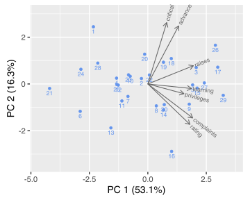
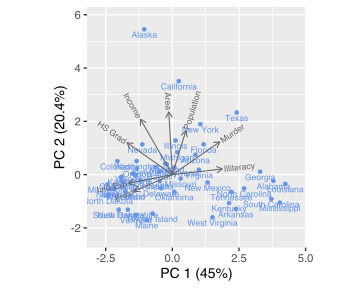
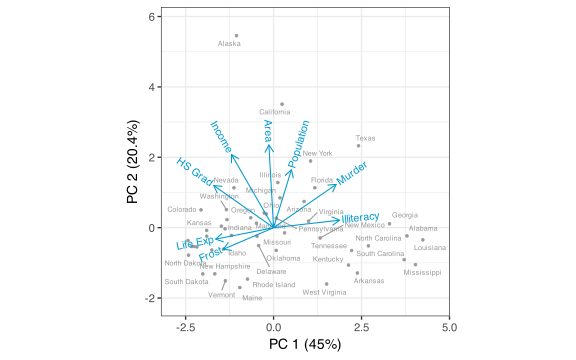
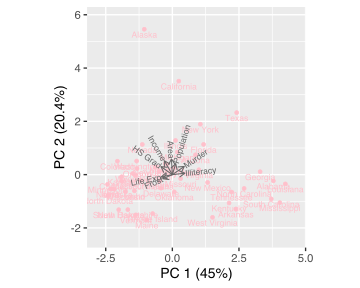
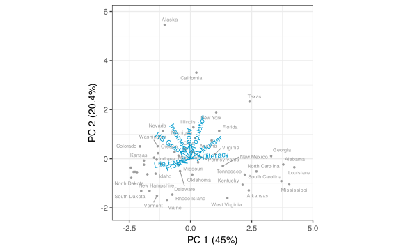

Joyce Robbins
2021-11-12

# redav

This package will eventually contain functions, data, and templates to
accompany data visualization courses.

As of now, it contains one function: `draw_biplot()`. This function was
developed mainly for teaching and learning purposes. There are other
options for drawing biplots in the **ggplot2** framework; `ggbiplot()`
in the [**ordr** package](https://github.com/corybrunson/ordr) is an
excellent choice. The main contributions of `draw_biplot()` are ease of
use and option to calibrate only one of the axes. Calibration
calculations are performed by `calibrate::calibrate()`.

Currently, `draw_biplot()` takes a data frame, performs principal
components analysis (PCA) on the numeric columns using `prcomp()` and
draws a biplot using the first non-numeric column as labels for the
principal component scores (points). Additional options besides PCA may
be added in the future.

## Installation

This package is not on CRAN. Install with:

``` r
remotes::install_github("jtr13/redav")
```

## Examples

``` r
library(redav)
draw_biplot(attitude)
```

<!-- -->

``` r
draw_biplot(attitude, key_axis = "raises") + 
  ggplot2::ggtitle("The Chatterjee-Price Attitude Data", 
          sub = "package: datasets (base R)")
```

<!-- -->

``` r
s77 <- as.data.frame(state.x77)
s77$state_name <- rownames(s77)
draw_biplot(s77)
```

<!-- -->

``` r
draw_biplot(s77, key_axis = "Murder", ticklab = 0:16, project = FALSE,
            point_color="lightblue") + ggplot2::theme_classic()
```

<!-- -->

``` r
draw_biplot(s77, mult = 1, point_color = "pink")
```

<!-- -->

``` r
draw_biplot(s77, points = FALSE)
```

<!-- -->
