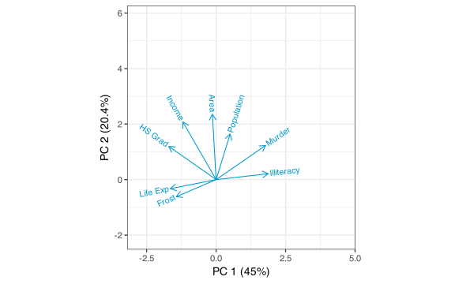
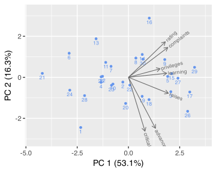
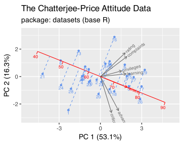
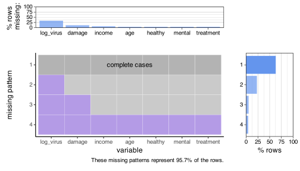
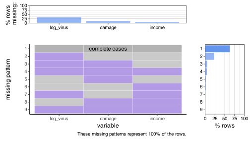
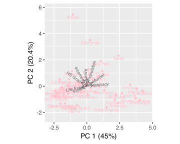
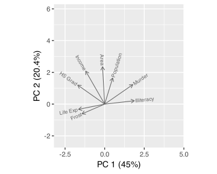
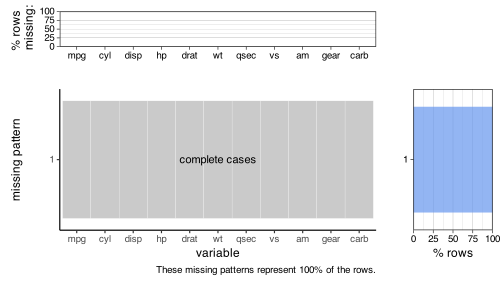

Joyce Robbins
2024-08-27

# redav

This package will eventually contain functions, data, and templates to
accompany data visualization courses.

If you encounter problems or have questions, please open an
[issue](https://github.com/jtr13/redav/issues) or start/contribute to a
[discussion](https://github.com/jtr13/redav/discussions).

As of now, it contains two functions: `draw_biplot()` and
`plot_missing()`.

There are other options for drawing biplots in the **ggplot2**
framework; `ggbiplot()` in the [**ordr**
package](https://github.com/corybrunson/ordr) is an excellent choice.
The main contributions of `draw_biplot()` are ease of use and option to
calibrate only one of the axes. Calibration calculations are performed
by `calibrate()` in the [**calibrate**
package](https://cran.r-project.org/web/packages/calibrate/index.html).

Currently, `draw_biplot()` takes a data frame, performs principal
components analysis (PCA) on the numeric columns using `prcomp()` and
draws a biplot using the first non-numeric column as labels for the
principal component scores (points). Additional options besides PCA may
be added in the future.

`plot_missing()` was designed as a replacement for `extracat::visna()`
which is no longer available on CRAN. It has improved labeling and the
option to label axes as percents or numbers.

## Examples

### `draw_biplot()`

``` r
library(redav)
swiss$country <- rownames(swiss)
draw_biplot(swiss)
```

<!-- -->

``` r
draw_biplot(attitude)
```

<!-- -->

``` r
draw_biplot(attitude, key_axis = "raises") + 
  labs(title = "The Chatterjee-Price Attitude Data",
       subtitle = "package: datasets (base R)")
```

<!-- -->

``` r
s77 <- as.data.frame(state.x77)
s77$state_name <- rownames(s77)
draw_biplot(s77)
```

<!-- -->

``` r
draw_biplot(s77, key_axis = "Murder", ticklab = 0:16, project = FALSE,
            point_color="deepskyblue3") + theme_classic()
```

<!-- -->

``` r
draw_biplot(s77, mult = 1)
```

<!-- -->

``` r
draw_biplot(s77, points = FALSE)
```

<!-- -->

### `plot_missing()`

``` r
library(redav)
data(CHAIN, package = "mi")
plot_missing(CHAIN)
```

<!-- -->

``` r
plot_missing(CHAIN, percent = FALSE)
```

<!-- -->

``` r
plot_missing(CHAIN, max_rows = 4)
```

<!-- -->

``` r
plot_missing(CHAIN, max_cols = 3)
```

<!-- -->

``` r
plot_missing(CHAIN, num_char = 5)
```

<!-- -->

``` r
plot_missing(CHAIN, max_rows = 4, max_cols = 3, num_char = 5, percent = FALSE)
```

<!-- -->

``` r
plot_missing(mtcars)
```

<!-- -->

*Rendered from* `Readme.Rmd`.
